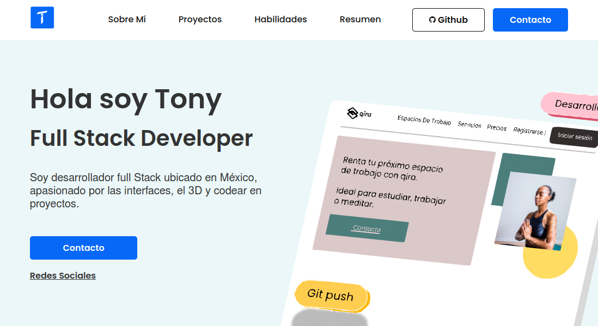
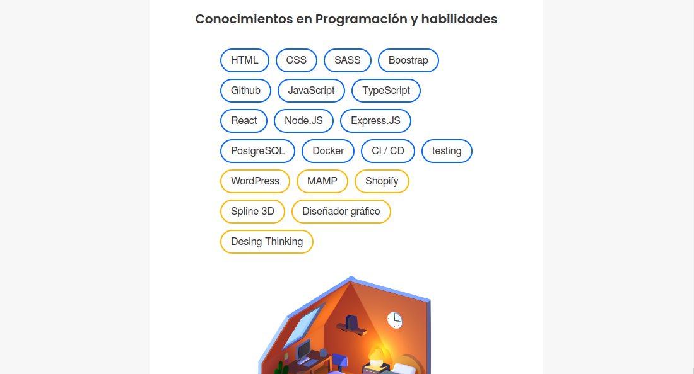
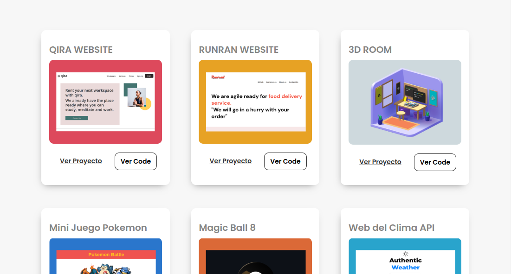
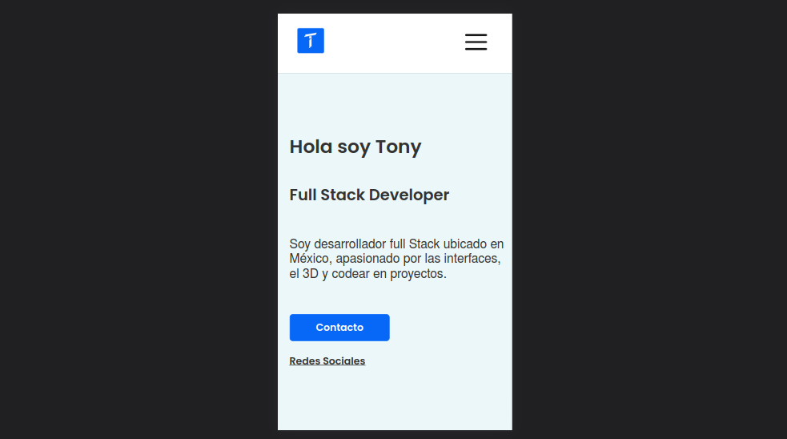
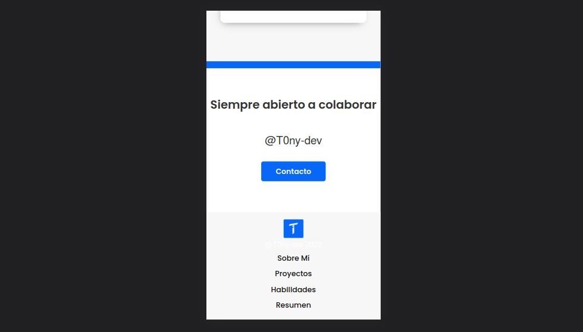

# Antonio Rodriguez 

  <h1>Portafolio</h1>
  <strong>Documentación del proyecto y marcos de trabajo que se utilizan</strong> 
  <strong>Proyectos</strong>

 

## Portafolio

Es una recopilación de prácticas y proyectos:

 

### 🏗 Equipo: 

- [@T0ny-dev](https://github.com/T0ny-dev)

### 👨‍💻 Listados de marcos de trabajo

* React.JS
* Vite
* CSS
* Metodología BEM CSS
* JavaScript
* Spline
* Eslint 
* react-router-dom

### 💻 Listados comandos 

* `git clone `    Clonara el repositorio
* `npm install `  instalará las dependencias de vite
* `npm run dev `  iniciara el servidor para vista previa en localhost:5173

### 💻 Deploy GitHub Pages
- [Netlify](https://t0ny-dev.netlify.app/)

### 🗎 Capturas del proyecto

